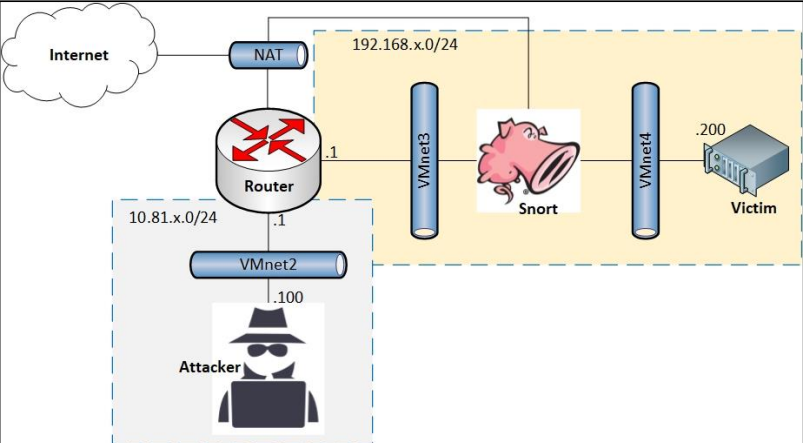

# 🛡️ Snort IDS/IPS  

Snort là một hệ thống **phát hiện và ngăn chặn xâm nhập (IDS/IPS)** mã nguồn mở, được phát triển bởi Cisco.  
Với khả năng phân tích gói tin theo thời gian thực và so khớp với tập luật, Snort được sử dụng rộng rãi trong:  

- Phát hiện các tấn công mạng phổ biến (DoS, port scan, buffer overflow, v.v.)  
- Giám sát lưu lượng mạng và phân tích gói tin  
- Ngăn chặn tấn công trực tiếp khi chạy ở **Inline Mode**  

---

## 📂 Nội dung repo  

- **Phân tích các tấn công và ngăn chặn bằng Snort**  
- **Phân tích gói tin (PhanTichGoiTin.pdf)**  
- **Tìm hiểu về Snort (TimHieuVeSnort.pdf)**  
- **Triển khai Snort Inline (TrienKhaiSnortInline.pdf)**  
- **Viết Rule trên Snort (VietRuleTrenSnort.pdf)**  

---

## 🖼️ Mô hình triển khai  

Mô hình lab Snort Inline mà mình đã triển khai:  

  

- Attacker: mạng 10.81.x.0/24  
- Router: định tuyến & NAT Internet  
- Snort: hoạt động Inline giữa VMnet3 và VMnet4  
- Victim: mạng 192.168.x.0/24 (host .200)  

---

## 🚀 Kinh nghiệm triển khai  

- ✅ Cài đặt & cấu hình Snort trên môi trường lab  
- ✅ Chạy Snort ở **Inline Mode** để chặn tấn công trực tiếp  
- ✅ Viết & kiểm thử các rule tùy chỉnh  
- ✅ Phân tích gói tin bằng tcpdump & log của Snort  

---

## 🔧 Cách sử dụng  

Clone repo và tham khảo tài liệu:  
```bash
git clone https://github.com/Huynx04/Snort-.git
cd Snort-
